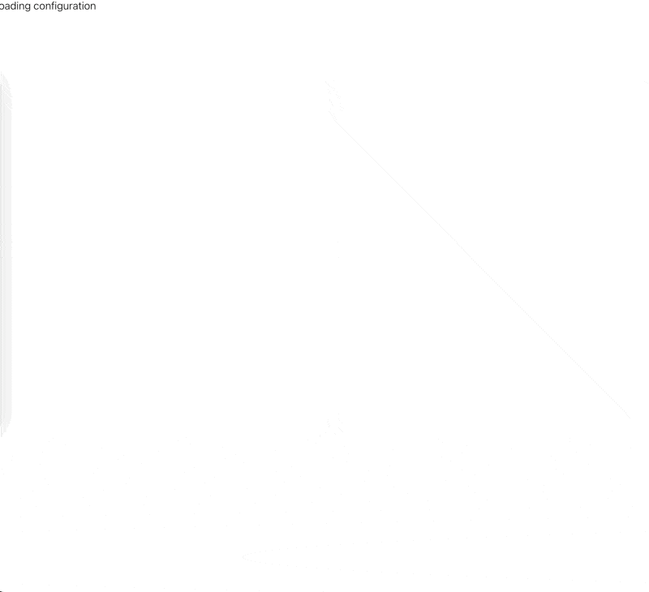

# coding

This is a small slide presentation framework to show code snippets in 
a nice and fancy way.

## demo

a simple presentation with two slides using different languages and windows.



## frameworks used

- react 
- highlight js
- zod
- animate.css

Just change the slides.json to fulfill your needs.

## slides syntax

header and footer support markdown.

```json
[
  {
    "config": {
      "background": string, // "default"
      "text": string, // "#eee"
      "showProgress": boolean // true
    },
    "header": {
      "text": string, 
      "align": enum, // "left","right", "center"
      "animate": string // "fadeIn"
    },
    "footer": {
      "text": string,
      "align": enum, // "left","right", "center"
      "animate": string // "fadeIn"
    },
    "code": {
      "language": string, // "text",
      "appearance": enum, // ["light", "dark"],
      "showMenu": boolean, //true,
      "linenumbers": boolean, // false,
      "title": string,
      "align":  enum, // "left","right", "center"
      "width": string, // "auto",
      "actions": [
        {
          "type": enum, // "insert","hightlight"
          "where": string, // "",
          "text": string
          "wait": number, // 0
        },
        {...}
      ]
    }
  }
]
```
